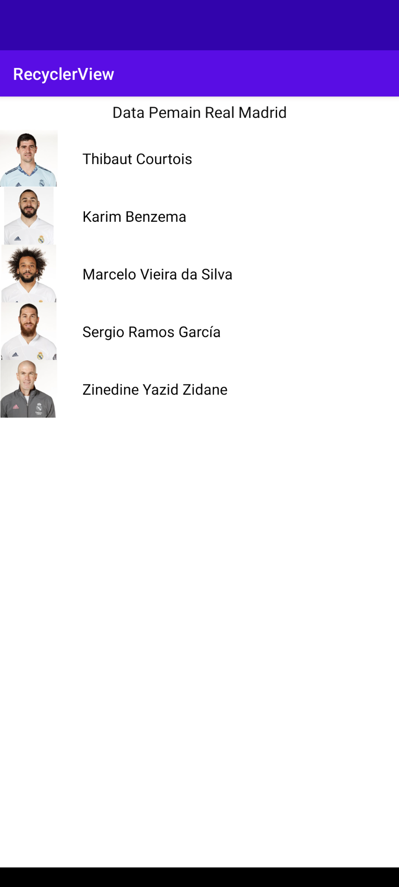
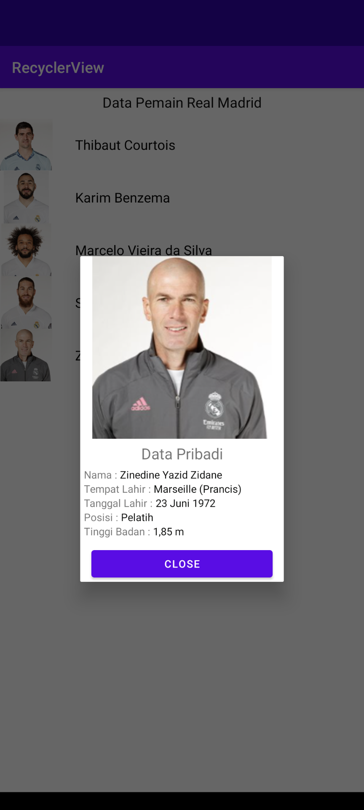

# Pemrograman Mobile : Recyclerview

##### _Pemrograman Mobile - TI.20.B.1 - Universitas Pelita Bangsa_

Assalamu'alaikum
Perkenalkan saya Faza Ardan Kusuma, mahasiswa Teknik Informatika dari Universitas Pelita Bangsa
Disini saya membuat repository guna untuk memenuhi Ujian Tengah Semester (UTS) mata kuliah Pemrograman Mobile yang diampu oleh Bapak Fajar Butsianto

Pada Repository ini, saya membuat aplikasi android menggunakan Bahasa Pemrograman Kotlin dan menggunakan _software_ Android Studio. Aplikasi Android yang saya buat adalah RecyclerView

### Apa itu Recycler View ?
Menurut _website : **android.com**_ , RecyclerView adalah ViewGroup yang berisi tampilan yang sesuai dengan data Anda. ViewGroup sendiri juga merupakan tampilan, jadi Anda menambahkan RecyclerView ke tata letak dengan cara yang sama seperti menambahkan elemen UI lainnya. Setiap elemen individual dalam daftar ditentukan oleh objek pemegang tampilan.

Aplikasi ini dibuat sesuai tutorial youtube dari Dosen Bapak Fajar Butsianto (https://www.youtube.com/@sufajarbutsianto671) untuk membuat sebuah aplikasi android sederhana, dimana aplikasi tersebut ada data - data dari pemain klub sepak bola Real Madrid yang mana bila di klik untuk salah satu dari list pemain akan muncul data pribadi dari pemain tersebut.

Berikut adalah hasil aplikasinya
 
Tampilan Halaman Utama :  
 

Tampilan Detail Data Pribadi / PopUp :  

## Terima Kasih